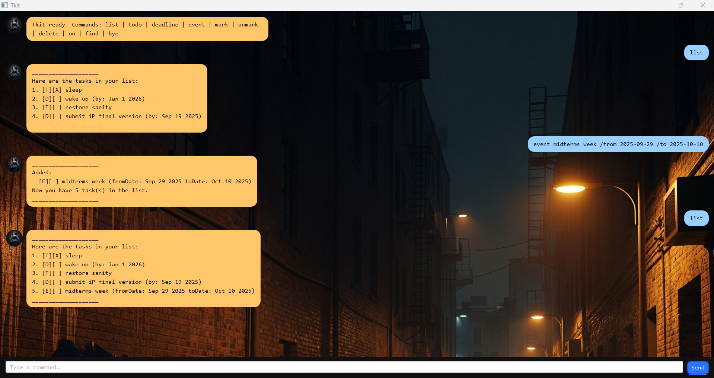

# Tkit — CLI Task Manager Chatbot



> Cross‑platform, Java 17. Minimal, durable, and testable.

---

## Table of Contents

* [Overview](#overview)
* [Feature Matrix](#feature-matrix)
* [Quick Start (Prebuilt JAR)](#quick-start-prebuilt-jar)
* [Command Reference](#command-reference)
* [Date/Time Input Formats](#datetime-input-formats)
* [Examples](#examples)
* [Persistence & File Format](#persistence--file-format)
* [Build From Source](#build-from-source)
* [Project Structure](#project-structure)
* [Design Notes](#design-notes)
* [Testing](#testing)
* [Troubleshooting](#troubleshooting)


---

## Overview

Tkit is a command‑line task manager chatbot. It tracks:

* **Todos** (description only)
* **Deadlines** (description + due date)
* **Events** (description + start and end date/time)

Tkit supports listing, adding, marking/unmarking, deleting, keyword search, and date‑based filtering. Data is saved to disk automatically after each change.

---

## Feature Matrix

| Capability      | Command(s)                                | Notes                                                         |
| --------------- | ----------------------------------------- | ------------------------------------------------------------- |
| List tasks      | `list`                                    | Renders numbered list with type and status icons              |
| Add todo        | `todo <DESCRIPTION>`                      | Rejects blank descriptions                                    |
| Add deadline    | `deadline <TASK> /by <DATE_OR_DATE_TIME>` | Multiple input formats supported                              |
| Add event       | `event <EVENT> /from <START> /to <END>`   | Validates start ≤ end                                         |
| Mark done       | `mark <N>`                                | 1‑based index                                                 |
| Mark not done   | `unmark <N>`                              | 1‑based index                                                 |
| Delete          | `delete <N>`                              | 1‑based index                                                 |
| Find by keyword | `find <KEYWORD>`                          | Case‑insensitive substring search                             |
| Filter by date  | `on <DATE or DATE TIME>`                  | Matches deadlines on that date; events intersecting that date |
| Exit            | `bye`                                     | Terminates the app                                            |

---

## Quick Start (Prebuilt JAR)

1. **Place** the JAR in an empty folder.
2. **Open** a terminal and `cd` into that folder.
3. **Verify Java 17**:

```sh
java -version
```

Expected output includes `"17"`.
4\) **Run Tkit** (do not double‑click the JAR):

```sh
java -jar "tkit.jar"
```

Notes:

* The first run creates a `data/` directory and a `data/Tkit.txt` save file alongside the JAR.
* Tkit persists after each mutation (add/mark/unmark/delete).

---

## Command Reference

> Commands are case‑insensitive. Indices are **1‑based**.

### List

```text
list
```

### Todo

```text
todo <DESCRIPTION>
```

### Deadline

```text
deadline <TASK> /by <DATE_OR_DATE_TIME>
```

Examples:

* `deadline return book /by 2019-12-02 1800`
* `deadline file taxes /by 2019-12-02`
* `deadline buy gift /by 2/12/2019 1800`

### Event

```text
event <EVENT> /from <START> /to <END>
```

Examples:

* `event project meeting /from 2019-12-02 1400 /to 2019-12-02 1600`
* `event travel /from 2019-12-02 /to 2019-12-05`

### Mark / Unmark

```text
mark <N>
unmark <N>
```

### Delete

```text
delete <N>
```

### Find by Keyword

```text
find <KEYWORD>
```

### Tasks on Date

```text
on <DATE or DATE TIME>
```

Examples:

* `on 2019-12-02`
* `on 2/12/2019`

### Exit

```text
bye
```

---

## Date/Time Input Formats

Input is parsed by `DateTimeUtil` with two branches:

* `yyyy-MM-dd[ HHmm]`
* `d/M/yyyy[ HHmm]`

Examples accepted:

* `2019-12-02`
* `2019-12-02 1800`
* `2/12/2019`
* `2/12/2019 1800`

Display formatting:

* If time is midnight → `MMM d yyyy` (e.g., `Dec 2 2019`)
* Otherwise → `MMM d yyyy HH:mm` (e.g., `Dec 2 2019 18:00`)

---

## Examples

### Sample Session

```text
____________________
Tkit ready. Commands: list | todo | deadline | event | mark | unmark | delete | on | find | bye
____________________

> todo read book
____________________
Added:
  [T][ ] read book
Now you have 1 task(s) in the list.
____________________

> deadline return book /by 2019-12-02 1800
____________________
Added:
  [D][ ] return book (by: Dec 2 2019 18:00)
Now you have 2 task(s) in the list.
____________________

> event project meeting /from 2019-12-02 1400 /to 2019-12-02 1600
____________________
Added:
  [E][ ] project meeting (fromDate: Dec 2 2019 14:00 toDate: Dec 2 2019 16:00)
Now you have 3 task(s) in the list.
____________________

> list
____________________
Here are the tasks in your list:
1. [T][ ] read book
2. [D][ ] return book (by: Dec 2 2019 18:00)
3. [E][ ] project meeting (fromDate: Dec 2 2019 14:00 toDate: Dec 2 2019 16:00)
____________________
```

### Errors

* Missing arguments are rejected with an error block and usage hints.
* Invalid indices: `Invalid task number: <N>. List has <K> task(s).`
* Invalid dates: `Unrecognized date/time` with guidance.

---

## Persistence & File Format

Tkit saves to `data/Tkit.txt` using a pipe‑delimited format with escaping. Corrupted lines are skipped and counted.

**Line model**

```
TYPE | DONE | DESCRIPTION | OTHER...
T | 1 | read book
D | 0 | return book | 2019-12-02T18:00
E | 0 | project meeting | 2019-12-02T14:00 | 2019-12-02T16:00
```

**Escaping rules**

* `\|` represents a literal pipe `|` inside a field
* `\\` represents a literal backslash `\`

**Durability**

* Writes to a temporary file, then atomically moves it into place (falls back to non‑atomic move if unavailable).

---

## Build From Source

Prerequisites:

* Java 17 (JDK)
* Gradle Wrapper included (`./gradlew`)

Common tasks:

```sh
# Run tests
./gradlew test

# Build runnable JAR (adjust task name if using Shadow or Application plugin)
./gradlew jar

# Run via Gradle (CLI main)
./gradlew run

# Run JAR (from project root after build)
java -jar build/libs/tkit.jar
```

If your build uses the Shadow plugin, replace `jar` with `shadowJar` and run the `*-all.jar` artifact.

---

## Project Structure

Key packages and classes (excerpt):

```
tkit/
  Tkit.java            -> CLI entrypoint and command loop
  Ui.java              -> Console renderer (pure stdout)
  Parser.java          -> Tokenizes input into (Command, remainder)
  Command.java         -> Enum of supported commands
  CommandProcessor.java-> Core handler used by GUI shell
  Task.java            -> Abstract base for Todo/Deadline/Event
  TaskType.java        -> Type tags: T/D/E
  Status.java          -> DONE / NOT_DONE
  Todo.java            -> Todo implementation
  Deadline.java        -> Deadline with due date
  Event.java           -> Event with start/end date
  DateTimeUtil.java    -> Parsing/formatting utilities
  Storage.java         -> Durable persistence with atomic move
  
  # JavaFX UI (optional GUI shell)
  MainApp.java, Launcher.java, MainWindow.java, DialogBox.java
  resources/tkit/*.fxml, *.css, images
```

The CLI and JavaFX GUI share the same domain, storage, and parsing logic.

---

## Design Notes

* **Single‑responsibility** classes: parsing, domain, persistence, UI separated.
* **Assertions** document invariants; enabled with `-ea` when debugging.
* **Defensive I/O**: corrupted lines are skipped; counts are surfaced.
* **Immutable value exposure**: `TaskList.view()` is unmodifiable.
* **Deterministic formatting** for dates and list rendering.

---

## Testing

Run all tests:

```sh
./gradlew test
```

Add unit tests under `src/test/java/tkit/` (e.g., `CommandProcessorTest`, `TaskListTest`, `DateTimeUtilTest`).

---

## Troubleshooting

* **`java: command not found`**: Install JDK 17 and ensure `java -version` shows 17.
* **JAR does nothing when double‑clicked**: Use the terminal: `java -jar tkit.jar`.
* **Save file missing**: It is created on first mutation in `data/Tkit.txt`.
* **Index out of range**: Commands use 1‑based indices; check `list` output.
* **Date rejected**: Conform to accepted formats listed above.

---